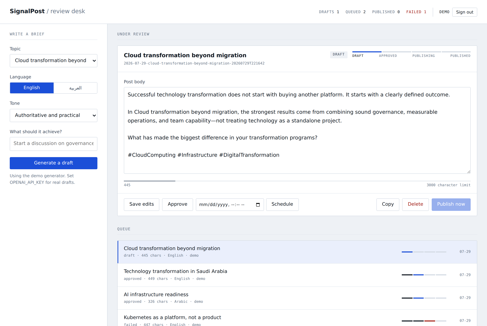

# SignalPost — LinkedIn AI Autoposter

A human-in-the-loop LinkedIn content studio for generating, reviewing, approving, and publishing professional posts. The default content profile focuses on cloud, infrastructure, AI platforms, Kubernetes, resilience, and technology transformation in Saudi Arabia.



## What is included

**New in 3.0** — a complete SignalPost brand experience, idea-first composer,
live LinkedIn preview, richer English and Arabic prompting, full RTL support,
accessible responsive UI, and stricter approval gates for manual and scheduled publishing.


- Modern responsive content dashboard
- English and Arabic post generation
- Configurable topic, tone, and objective
- OpenAI Responses API integration
- Safe demo generator when no AI key is available
- Editable post preview and content queue
- Draft, approved, publishing, published, and failed states
- Explicit human approval before publishing
- Current LinkedIn Posts API integration
- Single-image posts with JPG, PNG, or GIF upload, preview, and alt text
- GitHub OAuth with state validation and secure cookies
- GitHub Actions content schedule for Sunday, Tuesday, and Thursday at 08:00 Riyadh time
- Scheduled publishing with a due-post runner
- MCP server exposing the studio as tools to Claude Desktop and Claude Code
- API-key automation endpoints for n8n, cron, or any external scheduler
- PostgreSQL or filesystem persistence, chosen automatically
- Automated syntax and unit tests

## Content workflow

1. Select a professional topic.
2. Choose English or Arabic, a tone, and an objective.
3. Generate a draft.
4. Review and edit the content.
5. Approve it explicitly.
6. Publish now with confirmation, or schedule it for later.
7. Keep the generated record in durable storage.

The scheduled workflow generates drafts only. It does not publish unattended.

## Local setup

Requires Node.js 20 or newer.

```bash
npm ci
cp .env.example .env
npm start
```

Open `http://localhost:3000`.

For a credential-free local preview, set:

```env
DEMO_MODE=true
```

## Environment variables

| Variable | Required | Purpose |
| --- | --- | --- |
| `DEMO_MODE` | No | Enables safe local login and deterministic sample posts |
| `OPENAI_API_KEY` | For AI | Generates real AI drafts |
| `OPENAI_MODEL` | No | Defaults to `gpt-4.1-mini` |
| `GITHUB_CLIENT_ID` | For OAuth | GitHub OAuth application ID |
| `GITHUB_CLIENT_SECRET` | For OAuth | GitHub OAuth secret |
| `GITHUB_REDIRECT_URI` | Production | Exact OAuth callback URL |
| `ALLOWED_GITHUB_USERS` | Production | Comma-separated GitHub logins allowed into the dashboard |
| `LINKEDIN_CLIENT_ID` | Recommended | LinkedIn OAuth application ID |
| `LINKEDIN_CLIENT_SECRET` | Recommended | LinkedIn OAuth application secret |
| `LINKEDIN_REDIRECT_URI` | Recommended | Exact LinkedIn OAuth callback URL |
| `LINKEDIN_TOKEN_ENCRYPTION_KEY` | Recommended | Encrypts stored LinkedIn tokens |
| `LINKEDIN_ACCESS_TOKEN` | For publishing | LinkedIn OAuth access token with posting permission |
| `LINKEDIN_PERSON_URN` | For publishing | Author URN such as `urn:li:person:...` |
| `LINKEDIN_API_VERSION` | No | LinkedIn API version, currently `202601` |
| `DATABASE_URL` | On serverless | PostgreSQL connection string; enables durable posts and sessions |
| `NODE_ENV` | Production | Set to `production` to enable secure cookies and disable demo mode |

Never commit real credentials. Store production values in the hosting platform and GitHub Actions secrets.

## LinkedIn setup

Create a LinkedIn developer application, enable the Share on LinkedIn product, and obtain `w_member_social`. Configure `https://your-domain.example/auth/linkedin/callback`, set the LinkedIn OAuth variables above, and select **Connect LinkedIn** in the dashboard. Tokens are encrypted before storage. They are refreshed when LinkedIn supplies a refresh token; otherwise the dashboard reports when reconnection is required.

Static `LINKEDIN_ACCESS_TOKEN` and `LINKEDIN_PERSON_URN` values remain supported as a fallback, but expired tokens must be replaced manually.

The dashboard disables the publish button until both LinkedIn values are configured.

## GitHub OAuth setup

Create an OAuth App under GitHub Developer Settings:

- Homepage: your deployed application URL
- Callback: `https://your-domain.example/auth/github/callback`

Set the same callback value as `GITHUB_REDIRECT_URI`.

Set `ALLOWED_GITHUB_USERS=majaber1` (or your own comma-separated allowlist). An empty production allowlist denies all GitHub accounts, preventing other users from reaching your shared queue or LinkedIn connection.

## Persistence and deployment

Storage is selected at startup by the presence of `DATABASE_URL`:

| `DATABASE_URL` | Posts | Sessions / OAuth state | Suitable for |
| --- | --- | --- | --- |
| unset | JSON files under `content/posts` | process memory | local development, Railway, Fly.io, a VM or container with a persistent volume |
| set | PostgreSQL | PostgreSQL | Vercel and any other serverless host, plus any multi-instance deployment |

`GET /api/health` reports the active driver and whether it is durable.

Serverless platforms have a read-only filesystem and do not keep state between
invocations, so `DATABASE_URL` is **required** on Vercel. Without it, post
generation fails and GitHub sign-in cannot complete, because the OAuth `state`
written during the redirect is not visible to the instance that handles the
callback. Tables are created automatically on first start.

Set `NODE_ENV=production` on any live deployment. `DEMO_MODE` grants an
unauthenticated session for local preview and is deliberately ignored in
production; env vars belong in the hosting platform's settings, not in
`vercel.json`.

## Commands

```bash
npm run check
npm test
npm run generate
```

Manual scheduled run:

1. Open **Actions** in GitHub.
2. Select **Daily LinkedIn Post**.
3. Choose **Run workflow**.
4. Use test mode when production AI credentials are not configured.

## API

| Method | Endpoint | Purpose |
| --- | --- | --- |
| `GET` | `/api/health` | Provider and publishing status |
| `GET` | `/auth/me` | Current signed-in user |
| `GET` | `/api/topics` | Content topics |
| `GET` | `/api/posts` | Content queue |
| `POST` | `/api/posts/generate` | Create a draft |
| `PATCH` | `/api/posts/:id` | Save edits |
| `POST` | `/api/posts/:id/approve` | Approve a reviewed draft |
| `POST` | `/api/posts/:id/publish` | Publish an approved post with `confirm: true` |
| `POST` | `/api/posts/:id/schedule` | Queue a post for a specific time |
| `GET` | `/api/posts/:id` | Read one post |
| `DELETE` | `/api/posts/:id` | Remove a post |
| `PUT` | `/api/posts/:id/image` | Attach or replace one image |
| `GET` | `/api/posts/:id/image` | Preview the attached image |
| `DELETE` | `/api/posts/:id/image` | Remove the attached image |

## Important production note

AI generation can run immediately with an OpenAI key. Direct LinkedIn publishing depends on LinkedIn developer application approval and valid member-posting permissions; the application cannot bypass that external requirement.

Images are validated by signature, type, size, and pixel count. Filesystem deployments store them under `content/media`; PostgreSQL deployments store them in `post_images`. At publish time SignalPost initializes a LinkedIn image upload, sends the bytes to LinkedIn, and includes the returned Image URN in the Posts API request.

## Driving the studio from Claude (MCP)

`mcp/server.js` speaks MCP over stdio and exposes nine tools: `list_topics`,
`list_posts`, `get_post`, `generate_draft`, `edit_post`, `approve_post`,
`publish_post`, `delete_post`, and `studio_status`.

Approving and publishing are separate tools, and `publish_post` refuses to run
unless it is called with `confirm: true`. A model cannot post to LinkedIn as a
side effect of a vaguer instruction.

Add it to Claude Desktop's `claude_desktop_config.json`:

```json
{
  "mcpServers": {
    "signalpost": {
      "command": "node",
      "args": ["/absolute/path/to/linkedin-ai-autoposter/mcp/server.js"],
      "env": {
        "OPENAI_API_KEY": "sk-...",
        "DATABASE_URL": "postgresql://...",
        "LINKEDIN_ACCESS_TOKEN": "...",
        "LINKEDIN_PERSON_URN": "urn:li:person:..."
      }
    }
  }
}
```

To point it at a deployed instance instead of the local checkout, set
`SIGNALPOST_URL` and `AUTOMATION_API_KEY` and drop the other values.

## Automating with n8n

Import `automation/n8n-signalpost.json`. It contains three independent flows:

| Flow | Schedule | What it does |
| --- | --- | --- |
| Draft and notify | Sun/Tue/Thu 08:00 Riyadh | Generates a draft, emails it to you for review |
| Publish due | Every 15 minutes | Publishes posts you approved *and* gave a scheduled time |
| Weekly digest | Saturday 09:00 Riyadh | Reports drafts waiting and anything that failed |

Set three n8n environment variables: `SIGNALPOST_URL`, `SIGNALPOST_KEY`
(matching `AUTOMATION_API_KEY`), and `SIGNALPOST_NOTIFY_EMAIL`.

The publish flow only ever touches posts that are `scheduled`, were previously
approved, and have a `scheduledFor` in the past. It cannot publish a draft, so automation never
bypasses your review.

Post claims are atomic in PostgreSQL. If scheduler invocations overlap, only one can move an approved post to `publishing`, preventing duplicate LinkedIn posts.

### Automation endpoints

These authenticate with `x-api-key` instead of a browser session, and return 503
until `AUTOMATION_API_KEY` is set.

| Method | Endpoint | Purpose |
| --- | --- | --- |
| `POST` | `/api/automation/generate` | Create a draft, optionally with `scheduledFor` |
| `POST` | `/api/automation/publish-due` | Publish scheduled posts whose time has passed |
| `GET` | `/api/automation/pending` | Counts plus anything that failed |

## Docker

```bash
docker build -t signalpost .
docker run -p 3000:3000 --env-file .env signalpost
```
